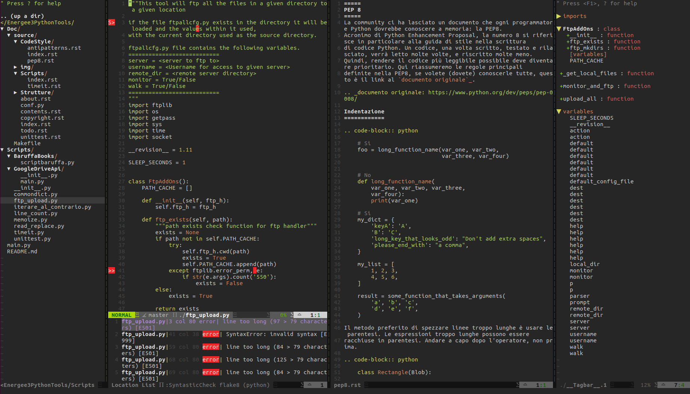

# La mia configurazione di VIM


In questo repository ho messo il mio file .vimrc e i plugin che uso. In particolare, sono inclusi i seguenti plugin:

    - SimpylFold (code folding)
    - Jedi-Vim (auto-completition)
    - vim-python-PEP8-indent (indentation)
    - Syntastic (syntax highlight)
    - Cucci Theme (color theme)
    - NerdTree (files tree)
    - ctrlp.vim (handle multiple files)
    - vim-fugitive (Git wrapper)
    - powerline (enhanced status line)
    - vim-signify (vari diffs)
    - vim-startify (spash screen - NB. me lo sono personalizzato)
    - vim-gitgutter (git diffs)


In più, sono state definite queste scorciatoie da tastiera:

  - <space> Folding
  - <C-J> Spostanti nel buffer a destra
  - <C-K> Spostati nel buffer in alto
  - <C-L> Spostati nel buffer in basso
  - <C-H> Spostati nel buffer a sinistra
  - <C-n> Mostra alberatura
  - <F5> Salva ed esegui con Python
  - <F3> Apre un nuovo buffer a destra con split verticale


Altre definizioni:

```vim
" Python - PEP 8
au BufNewFile,BufRead *.py
\ set tabstop=4 |
\ set softtabstop=4 |
\ set shiftwidth=4 |
\ set textwidth=79 |
\ set expandtab |
\ set autoindent |
\ set fileformat=unix
 
" Full Stack
au BufNewFile,BufRead *.js, *.html, *.css
\ set tabstop=2 |
\ set softtabstop=2 |
\ set shiftwidth=2 |
```

ScreenShots
-----------



License
----

MIT


**Free Software, Hell Yeah!**
